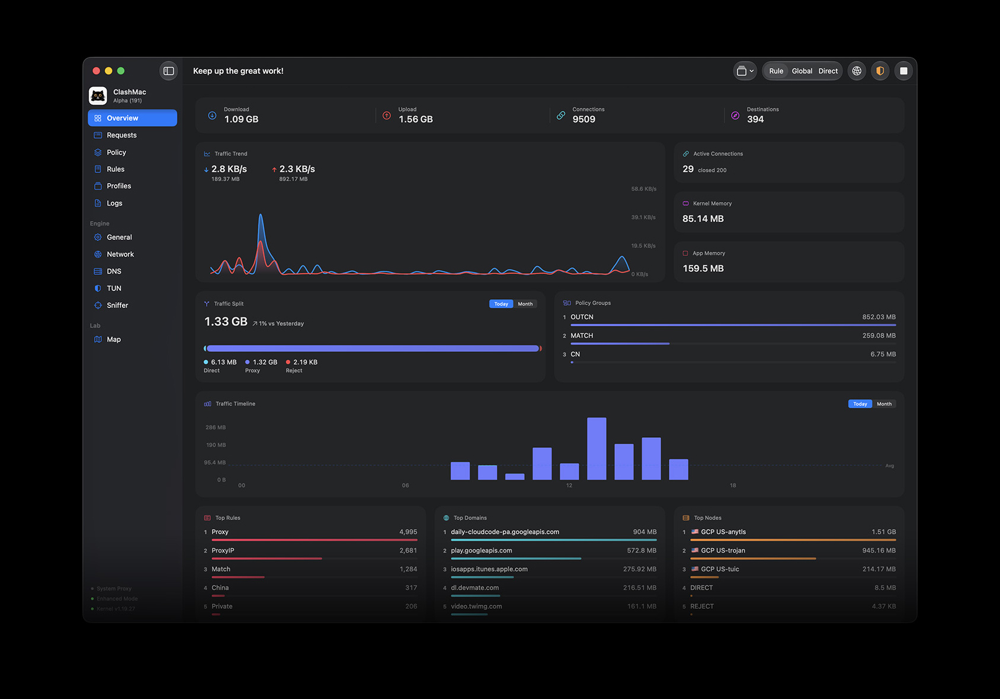
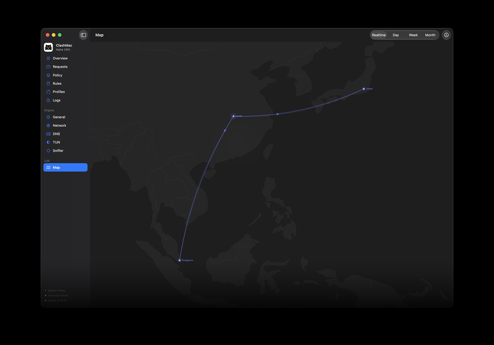
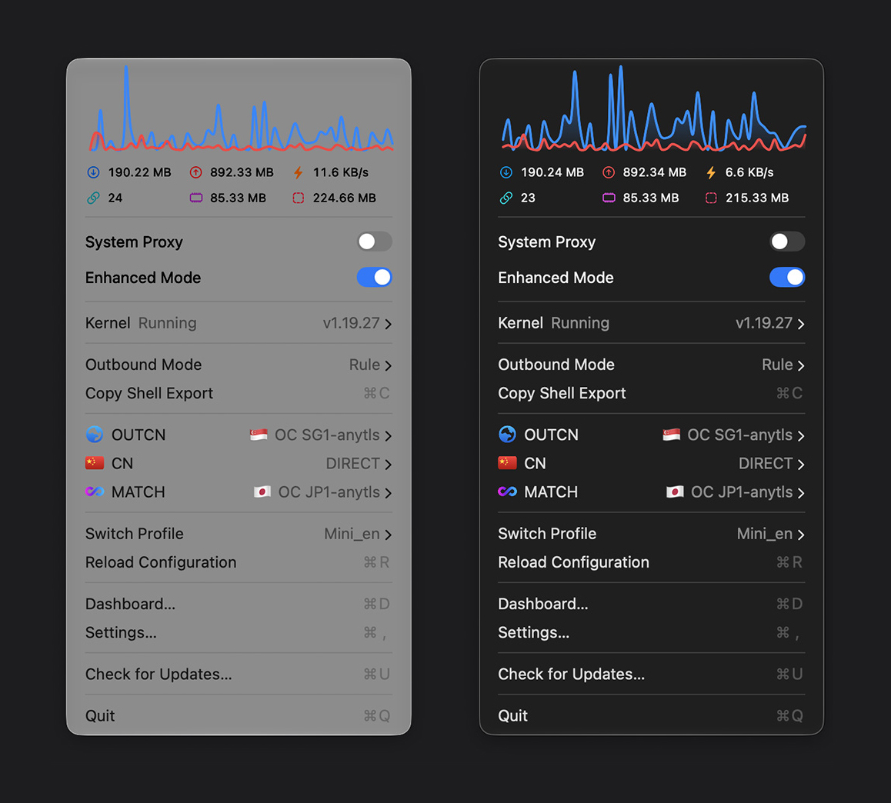

<p align="center">
  
</p>
<h1 align="center">ClashMac 2.0</h1>
<h3 align="center" style="margin-top: 0; margin-bottom: 10px;">Native Proxy Experience Built for macOS</h3>
<p align="center">
  🌐 <a href="https://clashmac.app"><strong>Official Website</strong></a>
  &nbsp;&nbsp;&nbsp;&nbsp;
  📖 <a href="https://clashmac.app/guide/"><strong>User Manual</strong></a>
</p>

<p align="center" style="margin-top: 0; margin-bottom: 20px;">
  <a href="https://github.com/666OS/ClashMac/releases/latest">
    
  </a>
  <a href="https://github.com/666OS/ClashMac/releases">
    
  </a>
  <a href="https://clashmac.app">
    
  </a>
  <a href="https://t.me/Pinched666">
    
  </a>
</p>

<table>
  <tr>
    <td colspan="2" align="center"></td>
  </tr>
  <tr>
    <td colspan="2" align="center"></td>
  </tr> 
  <tr>
    <td colspan="2" align="center"></td>
  </tr>
  <tr>
    <td colspan="2" align="center"></td>
  </tr>
</table>

## ✨ Features

### 🗺️ Visual Route Map
- **Live Flight Routes**: Watch your active proxy traffic fly across the globe in real-time, updating every 10 seconds.
- **Interactive Control**: Zoom, pan, and hover over paths for instant telemetry. Supports historical audit logs.
- **Smart Obfuscation**: Mask your precise location by randomizing your departure point across 190+ global cities.

### 🔍 Active Connections & Rules
- **Live Traffic Grid**: Check which apps are consuming bandwidth, their speeds, protocols, and routing rules.
- **One-Click Rule Maker**: Instantly add custom proxy or blocking rules for the active browser tab or process.
- **Instant Cut-off**: Disconnect any hogging connection with a simple right-click.

### 📊 Real-time Dashboard
- **Speed Curves**: High-definition, smooth graph tracking upload and download bandwidth over a 60-second window.
- **Leaderboards**: Automatically lists your most active target domains, matched rules, and destinations.
- **Resource Monitoring**: Track system memory footprint of both the UI and the underlying network engine.

---

## 🛠️ Built for macOS

- **100% Native**: Built exclusively in SwiftUI for native performance. Resides quietly in the menu bar with minimal CPU and memory footprints.
- **TUN Enhanced**: System-wide proxy integration with complete UDP/TCP capture.
- **No Setup Needed**: Ready out of the box with automated DNS, TUN, and routing database parameters.
- **Video Boost**: Disable QUIC protocols to prevent ISP throttling and eliminate buffering on YouTube and Netflix.
- **No Repeated Passwords**: Authorize network helper tool installation once—never get prompted for admin passwords again.

---

## 💻 Get Started

- **System Requirement**: macOS 15.0+ (Sequoia or later)

### Installation
1. Download the latest `ClashMac.dmg` disk image from the [Releases page](https://github.com/666OS/ClashMac/releases/latest).
2. Double-click the `.dmg` and **drag** `ClashMac.app` into your **Applications** folder.
   > [!CAUTION]
   > Do not run ClashMac directly from the `.dmg` installer window, as macOS security sandbox will prevent the application from saving settings and installing system network services.
3. On first launch, right-click `ClashMac.app` and select **Open**. ClashMac will register its system helper tool and automatically download the correct kernel engine matching your Mac's CPU architecture (Apple Silicon or Intel).

---

## 🛡️ Bypassing Gatekeeper

If macOS blocks launching with a warning (e.g., "developer cannot be verified"), use one of these solutions:

- **System Settings**: Go to **System Settings** $\rightarrow$ **Privacy & Security**, scroll down to find the block notice, and click **Open Anyway**.
- **Terminal Command**: Run the following command in Terminal to clear the quarantine flag:
  ```bash
  sudo xattr -rd com.apple.quarantine /Applications/ClashMac.app
  ```

---

## 🔒 Security & Privacy

- **100% Local**: All settings, traffic details, and history stay locally on your Mac. No data collection, tracking, or logs.
- **Secure Helper**: The background system helper is hardened and restricted to run core files solely from `/Applications/ClashMac.app/`.

---

## 📄 License & Credits

ClashMac is proprietary, closed-source software. Binary releases are provided in this repository.

View third-party credits and licenses here:  
👉 [THIRD_PARTY_LICENSES](https://github.com/666OS/ClashMac/blob/main/THIRD_PARTY_LICENSES.txt)

---

## Star History

[](https://star-history.com/#666OS/ClashMac&Date)

<p align="center">
  Crafted with ❤️ for macOS
</p>
